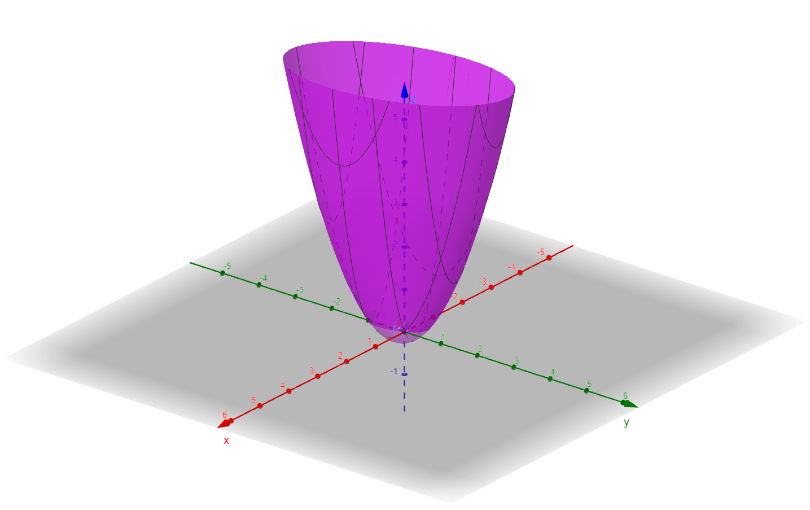
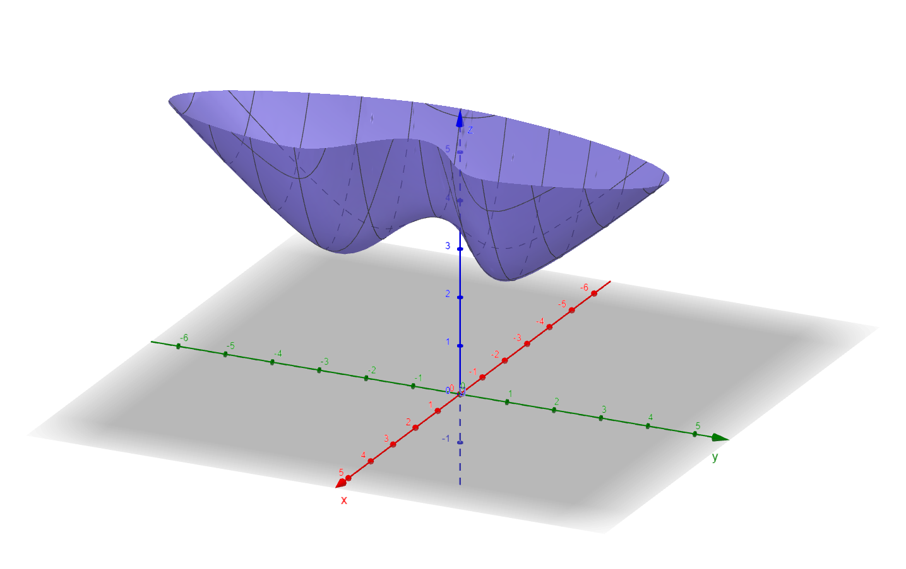
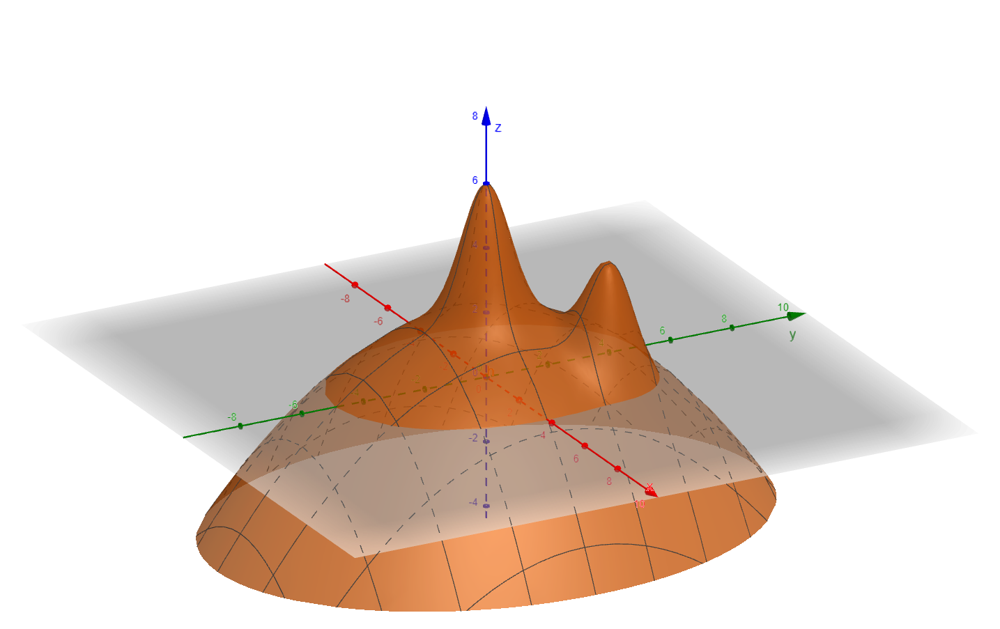

# Otimização pelo Vetor Gradiente

**Integrantes do Grupo 3**

* Eduardo
* Marcelo
* Wesley

---

## 📘 Descrição Geral

Este projeto apresenta a implementação prática do **método do gradiente** para otimização de funções multivariáveis. O trabalho é dividido em tarefas que envolvem determinar pontos de mínimo e máximo de funções atribuídas ao grupo, explorando o comportamento da convergência com diferentes tamanhos de passo (α) e métodos de atualização.

O notebook principal é **`Otimização pelo vetor gradiente.ipynb`**, e nele estão as implementações das funções e rotinas solicitadas nas tarefas.

---

## 🧮 Funções atribuídas ao Grupo 3

f(x,y) = 3x^2 + x y + y^2 + 2x + y

g(x,y) = sqrt(x^2 + y^2 + 3) + x^2 e^{-y^2} + (x - 2)^2

h(x,y) = 4 e^{-x^2 - y^2} + 3 e^{-x^2 - y^2 + 4x + 6y - 13} - x^2/7 - y^2/12 + 2


---

## 📂 Estrutura das Tarefas

### 🧩 **Tarefa 1 (40%) — Mínimo de f(x, y)**

**Objetivo:** Determinar o ponto de mínimo da função (f(x, y)) usando o método do gradiente com passo fixo.

**Etapas:**

1. Plotar o gráfico de (f(x, y)) e observar seu ponto de mínimo.

2. Determinar o vetor gradiente (∇f(x, y)).
$$ \nabla f = (\frac{\partial f}{\partial x},\frac{\partial f}{\partial y}) = (6x + y + 2, x + 2y + 1) $$

3. Implementar o método do gradiente com passo fixo ((α = 0.1)) e estimativa inicial ((x_0, y_0) = (0, 0)), com tolerância de (10^{-5}).
4. Repetir o processo para (α = 0.15, 0.2, 0.3, 0.5).
5. Analisar o número de iterações e o comportamento da convergência.


**Trecho de código:**

```python
import numpy as np

def f(x, y):
    return 3*x**2 + x*y + y**2 + 2*x + y

def grad_f(x, y):
    df_dx = 6*x + y + 2
    df_dy = x + 2*y + 1
    return np.array([df_dx, df_dy])

def gradient_descent(alpha, tol=1e-5, max_iter=10000):
    x, y = 0.0, 0.0  # ponto inicial
    for i in range(max_iter):
        grad = grad_f(x, y)
        new_x, new_y = x - alpha * grad[0], y - alpha * grad[1]
        if np.linalg.norm([new_x - x, new_y - y]) < tol:
            break
        x, y = new_x, new_y
    return (x, y), i

for alpha in [0.1, 0.15, 0.2, 0.3, 0.5]:
    ponto, iteracoes = gradient_descent(alpha)
    print(f"α={alpha:.2f} → Ponto mínimo: {ponto}, Iterações: {iteracoes}")
```

**Saída esperada (exemplo):**

```
Ponto inicial: (0, 0)
α=0.10 → Ponto minimo: (-0.272728, -0.3636309)
N de iterações: 56

α=0.15 → Ponto minimo: (-0.272728, -0.3636319)
N de iterações: 36

α=0.20 → Ponto minimo: (-0.272728, -0.3636310)
N de iterações: 25

α=0.30 → Ponto minimo: (-0.2727288, -0.3636367)
N de iterações: 89

α=0.50 → Ponto minimo: (nan, -inf)
N de iterações: 10000
Overflow!

```

**Discussão:**

* Passos menores resultam em convergência mais lenta porém estável.

| α   | Resultado             | Observação                          |
| --- | --------------------- | ----------------------------------- |
| 0.1 | Convergiu             | Estável                             |
| 0.2 | Convergiu mais rápido | Estável                             |
| 0.3 | Oscila levemente      | Quase estável                       |
| 0.5 | **Overflow**          | Passo grande → Divergência numérica |

* Passos grandes podem causar oscilação ou divergência dependendo da curvatura local.

---

### 🧩 **Tarefa 2 (20%) — Mínimos de g(x, y)**

**Objetivo:** Aplicar o código anterior para encontrar os dois pontos de mínimo da função (g(x, y)).



$$ g(x,y) = \sqrt{x^2 + y^2 + 3} + x^{2}e^{-y^2}+ (x - 2)^2 $$

$$ \frac{\partial g}{\partial x} = \frac{x}{\sqrt{x^2 + y^2 + 3}} + 2e^{-y^2}x + 2(x-2) $$

$$ \frac{\partial g}{\partial y} = \frac{y}{\sqrt{x^2 + y^2 + 3}} - 2e^{-y^2}x^2y $$

$$ \nabla g = (\frac{\partial g}{\partial x},\frac{\partial g}{\partial y}) = (\frac{x}{\sqrt{x^2 + y^2 + 3}} + 2e^{-y^2}x + 2(x-2),\frac{y}{\sqrt{x^2 + y^2 + 3}} - 2e^{-y^2}x^2y) $$

**Trecho de código:**

```python
def g(x, y):
    return np.sqrt(x**2 + y**2 + 3) + x**2 * np.exp(-y**2) + (x - 2)**2

def grad_g(x, y):
    df_dx = (x / np.sqrt(x**2 + y**2 + 3)) + 2*x*np.exp(-y**2) + 2*(x - 2)
    df_dy = (y / np.sqrt(x**2 + y**2 + 3)) - 2*y*x**2*np.exp(-y**2)
    return np.array([df_dx, df_dy])

def gradient_descent_g(x0, y0, alpha=0.1, tol=1e-5, max_iter=10000):
    x, y = x0, y0
    for i in range(max_iter):
        grad = grad_g(x, y)
        new_x, new_y = x - alpha * grad[0], y - alpha * grad[1]
        if np.linalg.norm([new_x - x, new_y - y]) < tol:
            break
        x, y = new_x, new_y
    return (x, y), i

# Encontrando os dois mínimos
p1, it1 = gradient_descent_g(0, 0)
p2, it2 = gradient_descent_g(2, 2)
print(f"Mínimo 1: {p1} em {it1} iterações")
print(f"Mínimo 2: {p2} em {it2} iterações")
```

**Resultados observados:**

```
- Ponto inicial 1: (0, 1)
 α=0.10 → Ponto minimo: (1.61268636, 1.645467316) 
 Iterações: 98


Ponto inicial 2: (0, -1)
α=0.10 → Ponto minimo: (1.61268636, -1.645467316)
Iterações: 98
```

**Discussão:**

* A função apresenta dois vales distintos. Dependendo do ponto inicial, o algoritmo converge para um deles.

---

### 🧩 **Tarefa 3 (20%) — Máximos de h(x, y)**

**Objetivo:** Adaptar o método do gradiente para encontrar pontos de **máximo** da função (h(x, y)).



$$ h(x,y) = 4e^{-x^{2}-y^{2}} + 3e^{-x^{2}-y^{2}+4x+6y-13} - \frac{x^2}{7} - \frac{y^2}{12} + 2 $$

$$ \frac{\partial h}{\partial x} = -8e^{-x^2-y^2}x-\frac{2x}{7}+3e^{-x^2+4x+6y-y^2-13}(-2x + 4) $$

$$ \frac{\partial h}{\partial y} = -8e^{-x^2-y^2}y-\frac{y}{6}+3e^{-x^2+4x+6y-y^2-13}(6 - 2y) $$

$$ \nabla h = (\frac{\partial h}{\partial x},\frac{\partial h}{\partial y}) = (-8e^{-x^2-y^2}x-\frac{2x}{7}+3e^{-x^2+4x+6y-y^2-13},-8e^{-x^2-y^2}y-\frac{y}{6}+3e^{-x^2+4x+6y-y^2-13}) $$


**Trecho de código:**

```python
def h(x, y):
    return 4*np.exp(-x**2 - y**2) + 3*np.exp(-x**2 - y**2 + 4*x + 6*y - 13) - (x**2)/7 - (y**2)/12 + 2

def grad_h(x, y):
    df_dx = (-8*x)*np.exp(-x**2 - y**2) + (-6*x + 4)*np.exp(-x**2 - y**2 + 4*x + 6*y - 13) - 2*x/7
    df_dy = (-8*y)*np.exp(-x**2 - y**2) + (-6*y + 6)*np.exp(-x**2 - y**2 + 4*x + 6*y - 13) - 2*y/12
    return np.array([df_dx, df_dy])

def gradient_ascent_h(x0, y0, alpha=0.05, tol=1e-5, max_iter=10000):
    x, y = x0, y0
    for i in range(max_iter):
        grad = grad_h(x, y)
        new_x, new_y = x + alpha * grad[0], y + alpha * grad[1]  # sinal invertido (subida)
        if np.linalg.norm([new_x - x, new_y - y]) < tol:
            break
        x, y = new_x, new_y
    return (x, y), i

# Encontrando os máximos
p1, it1 = gradient_ascent_h(0, 0)
p2, it2 = gradient_ascent_h(2, 2)
print(f"Máximo 1: {p1} em {it1} iterações")
print(f"Máximo 2: {p2} em {it2} iterações")
```

**Resultados observados:**

```
Ponto inicial 1: (0, 0)
α=0.10 → Ponto maximo: (2.712395288377267e-06, 4.0685929325659015e-06)
N de iterações: 1

Ponto inicial 2: (10, 10)
α=0.10 → Ponto minimo: (1.907742565615503, 2.917685246264727)
N de iterações: 65
```

**Discussão:**

* O método de subida no gradiente (ascent) é análogo ao de descida, apenas alterando o sinal do passo.

---

### 💡 **Tarefa Desafio (10%) — Passo Variável**

**Objetivo:** Implementar o método do gradiente com **passo variável**, comparando o desempenho com o método de passo fixo da Tarefa 1.

**Trecho de código:**

```python
def gradient_descent_variable_step(tol=1e-5, max_iter=10000):
    x, y = 0.0, 0.0
    for i in range(max_iter):
        grad = grad_f(x, y)
        alpha = 1 / (i + 1)  # passo variável decrescente
        new_x, new_y = x - alpha * grad[0], y - alpha * grad[1]
        if np.linalg.norm([new_x - x, new_y - y]) < tol:
            break
        x, y = new_x, new_y
    return (x, y), i

ponto, iteracoes = gradient_descent_variable_step()
print(f"Ponto mínimo com passo variável: {ponto}, Iterações: {iteracoes}")
```

**Resultados observados:**

```
Ponto inicial: (0, 0)
α=0.10 → Ponto minimo: (-0.2727285486985472, -0.36363095853530786)
Iterações: 56
```


**Comparativo:**

* O passo variável tende a suavizar a convergência, evitando oscilações, mas pode exigir mais iterações.

---

## 📊 Conclusões

* O método do gradiente é sensível ao tamanho do passo (α).
* Passos grandes podem causar divergência, enquanto passos pequenos garantem estabilidade porém aumentam o custo computacional.
* O método de passo variável mostrou melhor equilíbrio entre estabilidade e velocidade de convergência.

---

## 🧰 Requisitos

* Python 3.8+
* Jupyter Notebook
* Numpy

**Para executar:**

```bash
pip install numpy jupyter
jupyter notebook "Otimização pelo vetor gradiente.ipynb"
```

---

## 📎 Créditos

Trabalho desenvolvido por **Eduardo, Marcelo e Wesley** — INSPER, Curso de Ciência da Computação.
